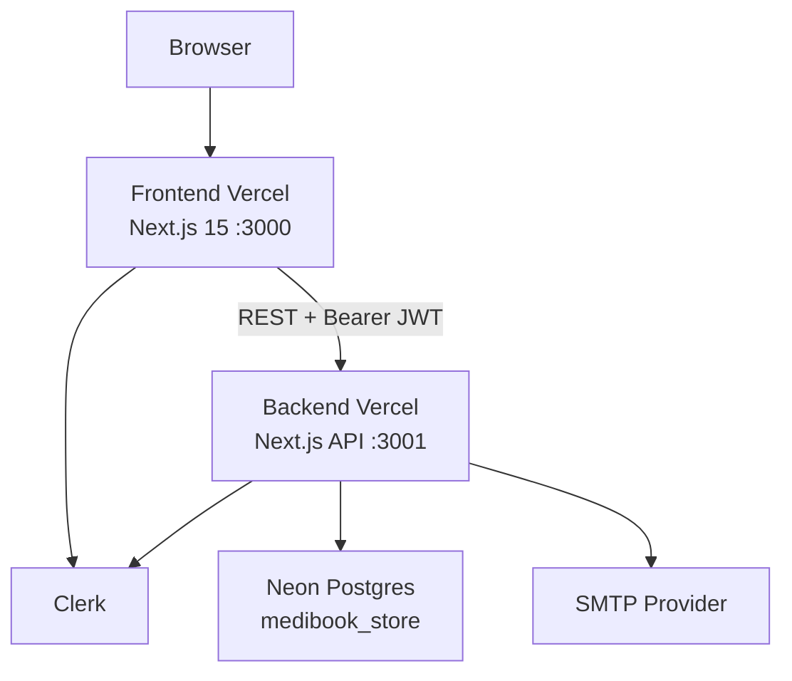
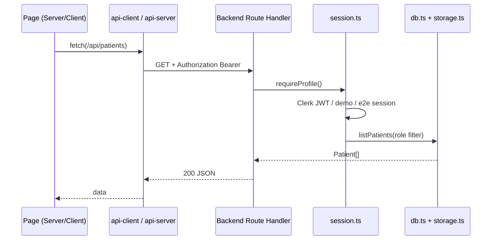
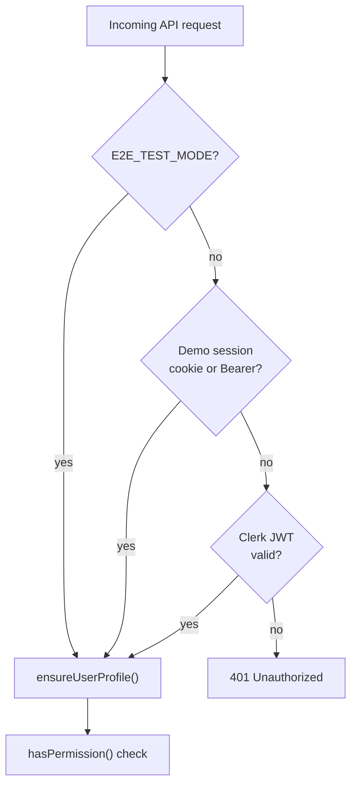
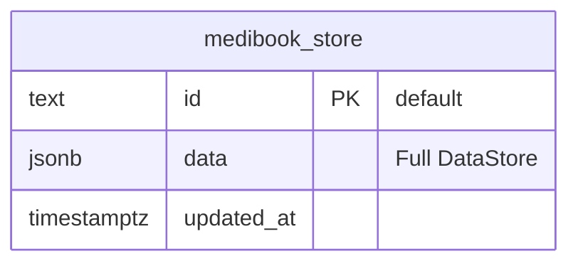
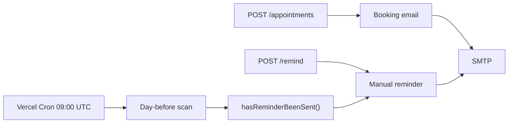
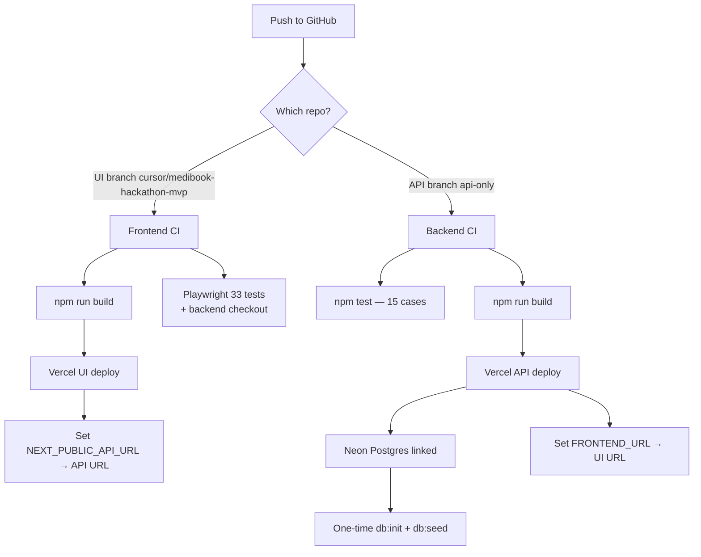

# MediBook Clinic — Architecture (Group 23)

System architecture for the TalentServ AI Hackathon MVP: split Next.js frontend, REST API backend, Neon Postgres, Clerk authentication, demo login mode, and SMTP notifications.

---

## High-level topology



| Deployment | URL |
|------------|-----|
| **UI** | https://talentserv-ai-hackathon-group-23-ui-devinaraina22s-projects.vercel.app |
| **API** | https://talentserv-ai-hackathon-group-23-ba.vercel.app |

| Repository | GitHub |
|------------|--------|
| **UI** | https://github.com/devinaraina22/talentserv-ai-hackathon-group-23-UI |
| **API** | https://github.com/devinaraina22/talentserv-ai-hackathon-group-23-backend |

---

## Frontend / backend split

The hackathon MVP evolved from a monolith into **two Vercel projects**:

| Concern | Frontend repo | Backend repo |
|---------|---------------|--------------|
| Pages & components | ✅ `src/app/(app)/*` | — |
| REST API | — | ✅ `src/app/api/*` |
| Business logic | — | ✅ `src/lib/db.ts` |
| Database | — | ✅ `src/lib/storage.ts` |
| Clerk UI | ✅ Sign-in, middleware | JWT verification only |
| SMTP / email | — | ✅ `email.ts`, `notifications.ts` |
| Cron | — | ✅ `/api/cron/reminders` |

The frontend **never** reads `store.json` or Postgres directly. All mutations go through HTTP to the API base URL (`NEXT_PUBLIC_API_URL` / `API_URL`).



---

## Authentication modes

Three auth paths converge in `requireProfile()` on the backend:



### 1. Clerk (production default when demo disabled)

- Frontend: `@clerk/nextjs` middleware protects routes; redirects unauthenticated users to `/login` or Clerk sign-in.
- Backend: `auth()` validates JWT from `Authorization: Bearer` header (cross-origin from UI).
- Role resolution: email matched against `role_assignments[]` (staff) or patient record (Patient role).

### 2. Demo login (judge-friendly)

Enabled when `NEXT_PUBLIC_DEMO_LOGIN=true` (UI) and `DEMO_LOGIN=true` (API).

- `/login` shows `DemoLoginPicker` instead of Clerk widget.
- Staff selection validates against `role_assignments` in Postgres.
- Patient demo uses seeded patient `riya@example.com`.
- Session stored in `medibook_demo_session` cookie; API accepts `Bearer demo-login-token` with demo headers.

### 3. E2E test mode

When `E2E_TEST_MODE=true`:

- Frontend middleware skipped; role set via `medibook_e2e_role` cookie.
- Backend accepts `Bearer e2e-test-token` + `X-E2E-Role` header.
- Uses local file storage (no Postgres) for CI speed.

---

## Data storage (Neon Postgres)

Production uses a **single JSONB document** pattern — appropriate for hackathon scale, easy migration from original file store.



**DataStore** structure (in `data` JSONB column):

| Collection | Purpose |
|------------|---------|
| `patients[]` | Registered patients (`PAT-xxx`) |
| `health_intakes[]` | Symptoms, consent, visit reason |
| `appointments[]` | Bookings (`APT-xxx`), status |
| `availability[]` | Weekly department slots |
| `user_profiles[]` | Clerk user ID → role cache |
| `role_assignments[]` | Staff email → role (+ department for doctors) |
| `audit_logs[]` | Action trail (max 500 entries) |
| `reminders[]` | Sent reminder log + dedup |

| Environment | Storage backend |
|-------------|-----------------|
| Vercel production | Neon via `DATABASE_URL` |
| Local dev (no DATABASE_URL) | `data/store.json` |
| CI unit tests | Reset from `data/seed.json` each test |
| CI e2e | File storage, seeded once |

**One-time production setup:**

```bash
npm run db:init   # CREATE TABLE medibook_store
npm run db:seed   # Load data/seed.json into Postgres
```

---

## Role-based access control

Permissions defined in `src/lib/auth.ts` (backend):

| Role | Key capabilities |
|------|------------------|
| **Admin** | `admin:all` — staff management, full CRUD, audit, reminders |
| **Receptionist** | Patients, appointments, status, audit, reminders |
| **Doctor** | Read patients/appointments, update status, manage availability |
| **Patient** | Own appointments, book for self, view receipt |

Nav visibility mirrors permissions via `canAccessNav()` in the frontend `AppShell`.

Data filtering examples:

- `GET /api/patients` as Patient → only record matching session email
- `GET /api/appointments` as Doctor → filtered by `department`
- `GET /api/audit` as Patient → **403**

---

## API design

REST Route Handlers under `/api/*`:

| Method | Path | Auth | Description |
|--------|------|------|-------------|
| GET | `/api/health` | Public | Health check `{ ok: true }` |
| GET/POST | `/api/patients` | RBAC | List/create patients |
| GET | `/api/patients/check` | Staff | Duplicate detection |
| GET/PUT | `/api/patients/[id]` | RBAC | Patient detail/update |
| POST | `/api/health` | Staff | Upsert health intake |
| GET/POST | `/api/appointments` | RBAC | List/book appointments |
| GET/PATCH | `/api/appointments/[id]` | RBAC | Detail/status update |
| POST | `/api/appointments/[id]/remind` | Admin/Recep | Manual reminder |
| GET | `/api/dashboard` | Authenticated | Stats widgets |
| GET/POST | `/api/availability` | Doctor+ | Slot configuration |
| DELETE | `/api/availability/[id]` | Doctor+ | Remove slot row |
| GET | `/api/audit` | Staff | Audit log |
| GET/POST | `/api/reminders` | Admin/Recep | Reminder history |
| GET/POST | `/api/user/role` | Authenticated | Profile/role assignment |
| GET/POST/DELETE | `/api/role-assignments` | Admin | Staff access CRUD |
| POST | `/api/demo-login` | Public* | Demo session (*when enabled) |
| POST | `/api/cron/reminders` | CRON_SECRET | Daily day-before job |
| GET | `/api/locations/countries` | Authenticated | Country picker data |
| GET | `/api/locations/cities` | Authenticated | City autocomplete |

**Key business rules** in `db.ts`:

- `isSlotTaken()` — excludes `Cancelled` status
- `isSlotInAvailability()` — day-of-week + time slot validation
- `checkDuplicatePatient()` — email or phone match
- `getDashboardStats().upcoming` — no health PHI fields

---

## Email & reminders



- **Nodemailer** with `SMTP_HOST`, `SMTP_PORT`, `SMTP_SECURE`, `SMTP_USER`, `SMTP_PASS`, `SMTP_FROM`
- HTML templates in `email-templates.ts` — MediBook branding, PAT/APT IDs
- Without SMTP: reminders logged with `simulated: true`
- Cron protected by `Authorization: Bearer ${CRON_SECRET}`

---

## CORS & cross-origin auth

Backend middleware (`src/middleware.ts`):

- Adds CORS headers for `FRONTEND_URL`, `localhost:3000`
- Handles `OPTIONS` preflight
- Does **not** call `auth.protect()` on API routes — JWT validated in handlers so Bearer tokens from the UI work cross-origin

Allowed headers include demo and e2e test headers for CI.

---

## Deployment flow



### Environment variables summary

**Frontend (`.env.example`):**

| Variable | Purpose |
|----------|---------|
| `NEXT_PUBLIC_CLERK_PUBLISHABLE_KEY` | Clerk UI |
| `CLERK_SECRET_KEY` | Server Clerk |
| `NEXT_PUBLIC_API_URL` / `API_URL` | Backend base URL |
| `NEXT_PUBLIC_DEMO_LOGIN` | Show demo picker at `/login` |

**Backend (`.env.example`):**

| Variable | Purpose |
|----------|---------|
| `DATABASE_URL` | Neon Postgres (required on Vercel) |
| `NEXT_PUBLIC_CLERK_PUBLISHABLE_KEY` / `CLERK_SECRET_KEY` | JWT verification |
| `FRONTEND_URL` | CORS origin |
| `DEMO_LOGIN` | Enable demo auth on API |
| `SMTP_*` | Email delivery |
| `CRON_SECRET` | Protect cron endpoint |

---

## Key design decisions

| Decision | Rationale | Trade-off |
|----------|-----------|-----------|
| Split UI/API repos | Independent deploy scales; clear hackathon demo of micro-frontend | More env wiring; CORS complexity |
| JSONB single-row store | Fast hackathon migration from file store; no ORM setup | Not normalized; won't scale to high concurrency |
| Clerk + demo login | Meets third-party auth requirement; judges skip sign-up | Demo mode must be disabled for real production |
| Zod validation shared pattern | Consistent 400 responses; testable schemas | Duplicated schema imports UI-side for client hints |
| RBAC in backend only | Single source of truth; UI hides nav but API enforces | UI must stay in sync with permission matrix |
| Audit log cap (500) | Prevents unbounded JSON growth | Older entries dropped silently |
| E2E test auth bypass | Reliable CI without real Clerk keys | Separate code path to maintain |

---

## Frontend route map

| Route | Access |
|-------|--------|
| `/` | Public landing |
| `/login` | Public — Clerk or demo picker |
| `/onboarding` | Authenticated — role setup |
| `/dashboard` | All roles |
| `/patients`, `/patients/new`, `/patients/[id]` | Staff |
| `/appointments`, `/appointments/new`, `/appointments/[id]` | Role-filtered |
| `/appointments/[id]/receipt` | Authenticated |
| `/availability` | Doctor (+ read for staff) |
| `/reminders` | Admin, Receptionist |
| `/audit` | Admin, Receptionist, Doctor |
| `/staff` | Admin only |

---

## Security notes

- No custom passwords stored
- API returns 401/403/409 with JSON errors — no stack traces in production
- Health intake and PHI limited to detail pages
- Cron endpoint requires secret header
- Demo login validates staff against database assignments (not client-trusted role alone)
