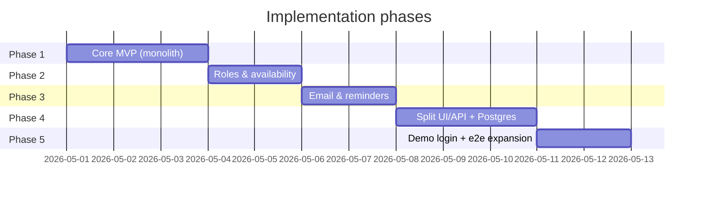
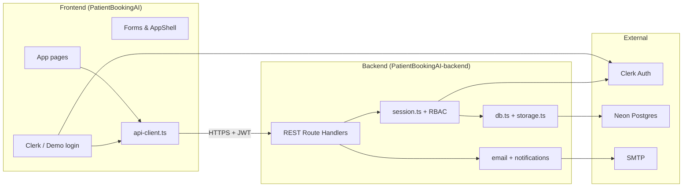

# MediBook Clinic — Solution Plan (Group 23)

Step-by-step implementation plan for the TalentServ AI Hackathon MVP. Responsibilities are described at **group level** — no individual assignments.

---

## Overview

MediBook Clinic was delivered in four phases over the hackathon window, using Cursor Agent for requirement decomposition, implementation, testing, and documentation iteration.

---

## Phase 1 — Core booking MVP

**Goal:** End-to-end patient registration and appointment booking with validation.

| Step | Module | Deliverable |
|------|--------|-------------|
| 1.1 | Scaffold | Next.js 15 app, Tailwind, MediBook branding |
| 1.2 | Data model | `Patient`, `Appointment`, `HealthIntake`, `DataStore` types |
| 1.3 | Persistence | `db.ts` read/write, seed data, ID generators (`PAT-`, `APT-`) |
| 1.4 | Validation | Zod schemas for patient, health, appointment |
| 1.5 | API routes | `GET/POST /api/patients`, `POST /api/health`, `GET/POST /api/appointments` |
| 1.6 | UI pages | Landing, patients list/new/detail, appointments list/new/detail |
| 1.7 | Business rules | Duplicate slot check; dashboard stats |
| 1.8 | Tests | Initial Vitest cases for validation and booking |

**Exit criteria:** Staff can register a patient, save intake, book an appointment, and see it on the dashboard.

---

## Phase 2 — Roles, availability, audit

**Goal:** Multi-role clinic operations and scheduling guardrails.

| Step | Module | Deliverable |
|------|--------|-------------|
| 2.1 | Auth integration | Clerk middleware, sign-in/sign-up pages |
| 2.2 | RBAC | `auth.ts` permissions matrix; nav gating in `AppShell` |
| 2.3 | Onboarding | Role resolution via `/api/user/role` and `user_profiles` |
| 2.4 | Availability | `DoctorAvailability` model, `/availability` UI, slot-aware booking |
| 2.5 | Audit | `logAudit()` on mutations; `/audit` page for Admin/Receptionist/Doctor |
| 2.6 | Receipt | Printable `/appointments/[id]/receipt` |
| 2.7 | Privacy fix | Remove PHI from dashboard upcoming widget |

**Exit criteria:** Each role sees appropriate nav; booking respects availability; audit entries appear on create/update.

---

## Phase 3 — Email & reminders

**Goal:** Real notification path for bookings and day-before reminders.

| Step | Module | Deliverable |
|------|--------|-------------|
| 3.1 | SMTP | Nodemailer config via `SMTP_*` env vars |
| 3.2 | Templates | HTML emails with MediBook branding, separate PAT/APT IDs |
| 3.3 | Booking email | Send on `POST /api/appointments` when SMTP configured |
| 3.4 | Manual reminders | `/reminders` page + `POST /api/appointments/[id]/remind` |
| 3.5 | Cron | `/api/cron/reminders` + `vercel.json` schedule + `npm run reminders:due` |
| 3.6 | Dedup | `hasReminderBeenSent()` prevents duplicate day-before emails |

**Exit criteria:** Booking creates email (or logs simulated); cron script processes tomorrow's appointments.

---

## Phase 4 — Frontend/backend split + Postgres

**Goal:** Production-ready deployment with persistent storage.

| Step | Module | Deliverable |
|------|--------|-------------|
| 4.1 | Repo split | UI repo (frontend only) + API repo (Route Handlers only) |
| 4.2 | API client | `api-client.ts` / `api-server.ts` proxy all data through `NEXT_PUBLIC_API_URL` |
| 4.3 | CORS | Backend middleware allows `FRONTEND_URL` + Bearer tokens |
| 4.4 | Postgres | Neon integration; `medibook_store` JSONB table; `storage.ts` adapter |
| 4.5 | Migrations | `npm run db:init` schema; manual one-time `db:seed` |
| 4.6 | CI split | Backend: Vitest + build; Frontend: build + Playwright with backend checkout |
| 4.7 | Vercel deploy | Two projects: UI + API with linked env vars |

**Exit criteria:** Production UI talks to production API; data persists across Vercel invocations.

---

## Phase 5 — Demo login & comprehensive e2e

**Goal:** Judge-friendly access and automated regression coverage.

| Step | Module | Deliverable |
|------|--------|-------------|
| 5.1 | Demo login | `/login` role picker; `demo-auth.ts` session cookies |
| 5.2 | Staff assignments | `role_assignments` in seed; Admin `/staff` management |
| 5.3 | E2E fixtures | Role cookies + Bearer token test mode |
| 5.4 | Playwright suites | UI flows, API permission tests, performance thresholds |
| 5.5 | Submission docs | Requirements, architecture, test plan, agentic evidence |

**Exit criteria:** 33 Playwright tests pass in CI; demo login works on production URL.

---

## Module map

---

## Implementation sequence (critical path)

1. **Data model & seed** — unblock all API and UI work  
2. **Validation schemas** — contract between UI and API  
3. **Core CRUD APIs** — patients, health, appointments  
4. **Auth + RBAC** — secure every route before expanding UI  
5. **Availability + slot rules** — correct booking behavior  
6. **UI pages** — mirror API capabilities per role  
7. **Email/reminders** — optional but demo-worthy  
8. **Split & Postgres** — production persistence  
9. **E2e tests** — lock in regression suite  
10. **Submission package** — documentation for judges  

---

## Group responsibilities (shared)

| Area | Group responsibility |
|------|---------------------|
| **Product** | User stories, demo script, judge talking points |
| **Frontend** | Pages, components, Clerk/demo UI, Playwright specs |
| **Backend** | API routes, `db.ts`, Postgres adapter, Vitest, cron |
| **DevOps** | Vercel projects, env vars, Neon seed, GitHub Actions |
| **QA** | Test plan execution, manual SMTP smoke test, demo rehearsal |
| **Documentation** | README, submission docs, agentic evidence, demo video |

---

## Risk mitigations planned

| Risk | Mitigation |
|------|------------|
| Vercel ephemeral file storage | Migrated to Neon Postgres JSONB row |
| Clerk sign-up friction for judges | Demo login mode with role picker |
| Cross-origin auth failures | CORS + Bearer JWT in API handlers (not middleware protect on API) |
| SMTP misconfiguration | Simulated reminder logs + `npm run email:test` script |
| PHI on dashboard | Explicit test asserting upcoming rows have no symptoms |

---

## Definition of done (hackathon)

- [x] All core user stories implemented
- [x] Third-party auth (Clerk) + demo login
- [x] 15 Vitest + 33 Playwright tests passing in CI
- [x] UI and API deployed to Vercel
- [x] Postgres seeded in production
- [ ] Demo video recorded (3-part structure — see `AGENTIC_EVIDENCE.md`)
- [x] Submission documentation package complete
