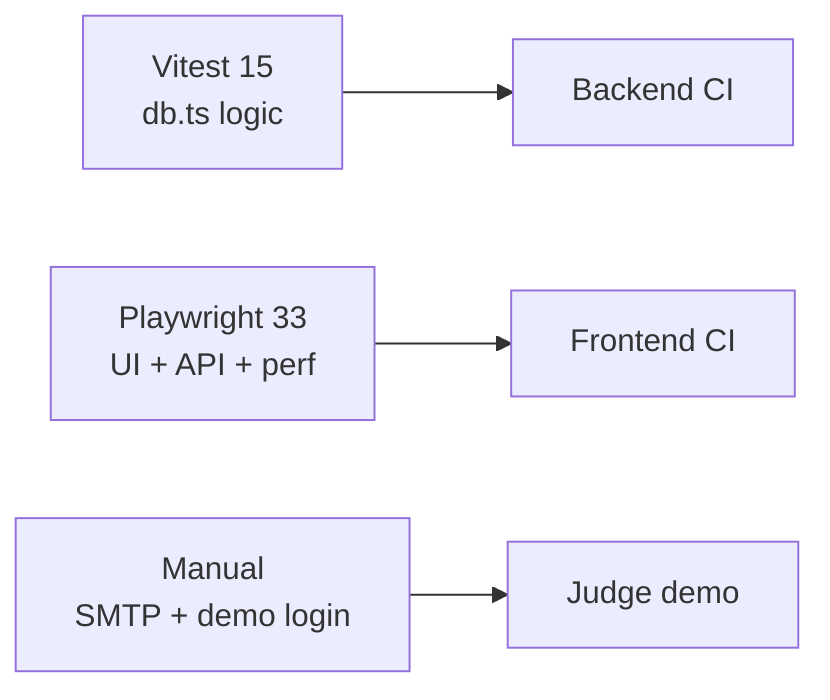

# MediBook Clinic — Test Plan (Group 23)

Comprehensive test plan for the TalentServ AI Hackathon MVP. Automated tests run in CI; manual checks cover SMTP and production demo login.

---

## Test strategy

| Layer | Tool | Location | Count | When |
|-------|------|----------|-------|------|
| **Unit / integration** | Vitest | Backend `tests/booking.test.ts` | **15 tests** | Every backend push (CI) |
| **E2E UI + API** | Playwright | Frontend `e2e/*.spec.ts` | **33 tests** | Frontend CI (builds both apps) |
| **Manual** | Browser + terminal | Production URLs, SMTP scripts | Ad hoc | Pre-submission demo |



---

## How to run

### Backend unit tests

```bash
cd PatientBookingAI-backend
npm install
npm run db:seed
npm test
```

Uses local file storage — resets from `data/seed.json` in `beforeEach`.

### Frontend e2e tests

```bash
# Terminal 1 — backend
cd PatientBookingAI-backend
npm run db:seed && npm run dev

# Terminal 2 — frontend
cd PatientBookingAI
npm run test:e2e
```

CI runs both automatically: frontend workflow checks out backend repo (`api-only` branch), seeds, builds, and runs all 33 Playwright tests.

---

## Vitest coverage (`tests/booking.test.ts`)

| # | Suite | Test case | Expected result |
|---|-------|-----------|-----------------|
| V1 | Patient registration | Accepts valid patient data | `patientSchema.safeParse` → success |
| V2 | Patient registration | Rejects invalid phone (too short) | `safeParse` → failure |
| V3 | Patient registration | Detects duplicate by email | `checkDuplicatePatient` → duplicate, PAT-001 |
| V4 | Patient registration | Creates patient record | Returns `PAT-010` |
| V5 | Health intake | Requires consent acknowledgement | Schema fails when `consent_acknowledged: false` |
| V6 | Health intake | Saves intake for existing patient | Returns intake for PAT-003 |
| V7 | Doctor availability | Returns slots for GP on Monday | Slots include `10:30 AM` |
| V8 | Doctor availability | Rejects slot outside availability | `isSlotInAvailability` → false for `04:30 PM` |
| V9 | Appointment booking | Validates appointment schema | Valid dental booking passes |
| V10 | Appointment booking | Books on available slot | Status `Booked` |
| V11 | Duplicate slot | Detects taken slot | `isSlotTaken` → true for seeded APT |
| V12 | Duplicate slot | Blocks duplicate booking | `createAppointment` throws /already booked/i |
| V13 | Audit | Writes audit log entry | New entry appears in `listAuditLogs()` |
| V14 | Reminders | Logs reminder + prevents duplicate | `hasReminderBeenSent` → true after first |
| V15 | Dashboard | Returns stats without health PHI | `upcoming` rows have no `symptoms` property |

---

## Playwright e2e coverage (33 tests passing)

### `e2e/landing.spec.ts` (1 test)

| ID | Category | Test case | Expected result |
|----|----------|-----------|-----------------|
| E01 | Happy path | Public landing shows MediBook branding + sign-in CTA | Heading and link visible |

### `e2e/admin-patient-flows.spec.ts` (10 tests)

| ID | Category | Test case | Expected result |
|----|----------|-----------|-----------------|
| E02 | Happy path | Admin dashboard loads with stats | "Total Appointments" visible; role badge Admin |
| E03 | Happy path | Patients list shows seeded records | Riya Sharma, PAT-001 visible |
| E04 | Negative / validation | Register patient with bad phone | Error message visible; no navigation |
| E05 | Happy path | Register patient successfully | Redirect to `/patients/PAT-021`; heading visible |
| E06 | Happy path | Save health intake on patient detail | "Saved Health Intake" message |
| E07 | Happy path | Book appointment on available slot | Redirect to receipt; confirmation visible |
| E08 | Happy path | Audit log accessible for admin | ASSIGN_ROLE cell visible |
| E09 | Auth / RBAC | Patient sees limited nav | No patients/audit nav; appointments visible |
| E10 | Auth / RBAC | Patient redirected from `/patients` | Lands on `/appointments` |
| E11 | Happy path | Patient views own appointments | APT-001 visible |

### `e2e/api.spec.ts` (17 tests)

| ID | Category | Test case | Expected result |
|----|----------|-----------|-----------------|
| E12 | Happy path | GET `/api/health` | 200, `{ ok: true }` |
| E13 | Auth | POST `/api/health` without auth | 401 |
| E14 | Validation | POST `/api/health` without consent | 400 |
| E15 | Happy path | POST `/api/health` saves intake | 200, patient_id PAT-003 |
| E16 | Happy path | GET `/api/patients` as Admin | 200, non-empty array |
| E17 | Auth / RBAC | GET `/api/patients` as Patient | 200, exactly 1 record (own email) |
| E18 | Validation | POST `/api/patients` invalid phone | 400 |
| E19 | Auth / RBAC | POST `/api/patients` as Patient | 403 |
| E20 | Happy path | POST `/api/patients` creates record | 201, PAT-010 |
| E21 | Happy path | GET `/api/appointments` as Admin | 200, non-empty |
| E22 | Edge case | POST appointment on taken slot | 409 |
| E23 | Auth / RBAC | PATCH appointment as Patient | 403 |
| E24 | Happy path | PATCH appointment as Admin | 200, status Completed |
| E25 | Auth / RBAC | GET `/api/audit` as Patient | 403 |
| E26 | Happy path | GET `/api/audit` as Admin | 200, array |
| E27 | Auth | GET `/api/user/role` as Admin | 200, role Admin |
| E28 | Auth | GET `/api/user/role` as Patient | 200, role Patient |

### `e2e/performance.spec.ts` (5 tests)

| ID | Category | Test case | Expected result |
|----|----------|-----------|-----------------|
| E29 | Performance | Landing page load | &lt; 8000 ms |
| E30 | Performance | Admin dashboard load | &lt; 8000 ms |
| E31 | Performance | GET `/api/dashboard` | 200, &lt; 2000 ms |
| E32 | Performance | GET `/api/patients` | 200, &lt; 2000 ms |
| E33 | Performance | GET `/api/appointments` | 200, &lt; 2000 ms |

---

## Manual test scenarios (pre-demo)

### Happy path — staff workflow

1. Open production UI → `/login` → select Admin (demo login)
2. Dashboard loads with stats
3. Register new patient PAT-099 with valid data
4. Save health intake with consent checked
5. Book appointment for available Monday slot → receipt page
6. Open audit log → verify CREATE entries

### Happy path — patient workflow

1. Demo login as Patient
2. Confirm limited navigation
3. View appointments list — only own records
4. Open receipt for an appointment

### Negative cases

| Scenario | Steps | Expected |
|----------|-------|----------|
| Duplicate slot | Book same dept/date/time twice | UI error or API 409 |
| Invalid phone | Enter 5-digit phone on register form | Validation error |
| No consent | Submit health intake unchecked | 400 / form error |
| Unauthorized audit | Patient navigates to `/audit` | Redirect or empty (nav hidden) |

### Auth scenarios

| Scenario | Expected |
|----------|----------|
| API call without Bearer token | 401 |
| Patient POST `/api/patients` | 403 |
| Clerk sign-in (when demo disabled) | Redirect to dashboard after auth |

### Edge cases

| Scenario | Expected |
|----------|----------|
| Cancel appointment then rebook same slot | Slot available again |
| Book outside doctor availability | Rejected |
| Duplicate patient email | Warning / duplicate detection |
| Second day-before reminder | Skipped (dedup log) |

### SMTP (optional)

```bash
cd PatientBookingAI-backend
npm run email:test your-email@example.com
```

Verify MediBook-branded HTML arrives. Book appointment in UI to trigger confirmation email.

---

## CI configuration reference

| Repo | Workflow | Triggers | Jobs |
|------|----------|----------|------|
| Frontend | `.github/workflows/ci.yml` | `main`, `cursor/medibook-hackathon-mvp` | `frontend-build`, `e2e` (33 tests) |
| Backend | `.github/workflows/ci.yml` | `main`, `api-only` | `test-and-build` (Vitest + build) |

E2E CI env: `E2E_TEST_MODE=true`, `DEMO_LOGIN=false`, placeholder Clerk keys, backend on port 3001.

---

## Test data

- Source: `PatientBookingAI-backend/data/seed.json`
- Seeded patients: PAT-001 through PAT-004 (synthetic)
- Seeded appointments: APT-001+ with mixed statuses
- Role assignments: Admin, Receptionist, Doctor staff records
- Availability: Mon–Fri department schedules

---

## Exit criteria

| Criterion | Status |
|-----------|--------|
| All 15 Vitest tests pass | ✅ CI |
| All 33 Playwright tests pass | ✅ CI |
| Manual demo script rehearsed | ⬜ Team |
| Production demo login verified | ⬜ Team |
| SMTP smoke test (optional) | ⬜ Team |

---

## Known test limitations

- E2E uses test auth bypass — does not exercise real Clerk OAuth flow
- Performance thresholds are generous for CI cold starts
- Vitest runs against file storage, not Postgres (logic is shared via `storage.ts`)
- SMS reminders not covered by automated tests (simulated only)
